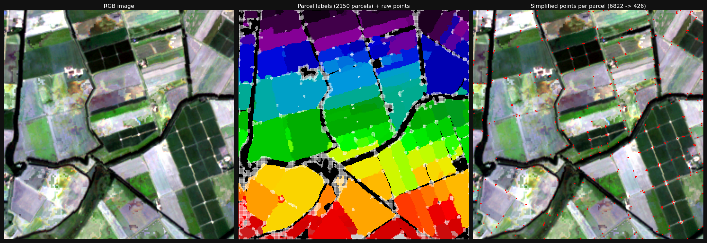
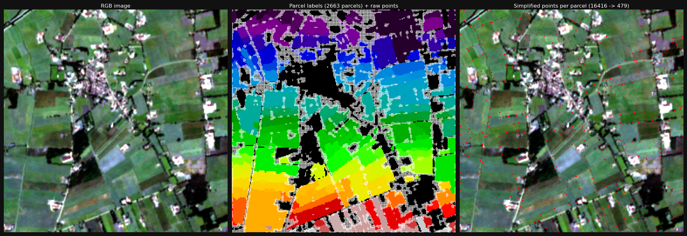
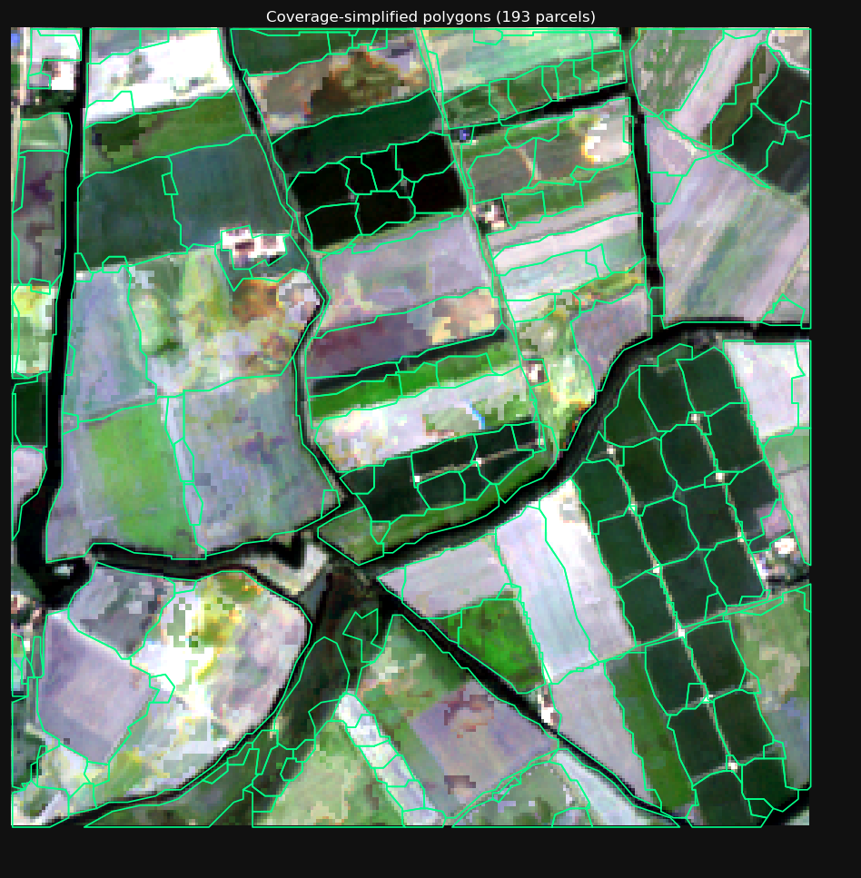

# Netherlands BRP Dataset Reconstruction — PLR-Net

Reconstruction of the Netherlands Sentinel-2 dataset used in the PLR-Net article:

> Mengmeng Li et al., *"Extracting vectorized agricultural parcels from high-resolution
> satellite images using a Point-Line-Region interactive multitask model"*,
> Computers and Electronics in Agriculture, 231 (2025) 109953.

---

## Motivation

The article reports **mask IoU = 75.86%** on a national Netherlands dataset
(~64,800 km², 6,940 training patches, 1,504 test patches at 256×256 px, 10 m/px).
This dataset is not publicly available.

A preliminary experiment on the `sentinel-2-nl` subset of Ai4SmallFarms
(87 tiles of ~1 km², same BRP labels) reached **mask IoU = 0.674**,
with the gap attributed to the 7× smaller training set (87 km² vs 64,800 km²).
This motivated reconstructing the full national dataset from open sources.

---

## Why the two datasets are incompatible

| Criterion | PLR-Net article | sentinel-2-nl (Ai4SmallFarms) |
|-----------|----------------|-------------------------------|
| Spatial extent | National mosaic ~64,800 km² (42,845×31,580 px) | 87 sparse tiles ~1×1 km each |
| Image source | PDOK official composite | Independent acquisition |
| Radiometric range | 0–~8,000 (BOA reflectance) | 0–~20,000 |
| Labels | Full BRP 2020 (all parcel types) | BRP subset (GeoPackage per tile) |
| Patch extraction | Sliding window on 3 geographic boxes | No patch extraction (tile = sample) |
| Train/test split | 2 red boxes (train) + 1 yellow box (test) | 60/13/14 tiles geographic split |

Results on `sentinel-2-nl` cannot be directly compared to the article.
They constitute a **geographic transfer evaluation** (model trained on NL national
data, tested on a different NL acquisition), not a reproduction.

---

## Data Sources

| Source | Description | URL |
|--------|-------------|-----|
| Sentinel-2 L2A | Cloud-free median composite, May–Oct 2020, 10 m, EPSG:28992 | Google Earth Engine |
| BRP 2020 | Dutch agricultural parcel cadastre (GeoPackage) | https://www.pdok.nl |

---

## Pipeline Overview

```
GEE export (4 quadrants)
       ↓
step1_merge_mosaic.py      → NL_mosaic_2020_10m.tif       (28,966 × 32,488 px)
       ↓
step2_rasterize_brp.py     → NL_BRP2020_10m_labels.tif    (parcel IDs raster)
       ↓
step3_extract_patches.py   → patches/train/  6,942 patches
                           → patches/test/   1,505 patches
       ↓
split_train_val.py         → train.txt (5,553)  val.txt (1,389)
       ↓
step5_build_coco.py        → coco/train_coco.json  (358,996 annotations)
                           → coco/val_coco.json    ( 89,838 annotations)
                           → coco/test_coco.json   ( 96,910 annotations)
       ↓
compute_normalization.py   → PIXEL_MEAN / PIXEL_STD for PLR-Net.yaml
```

---

## Directory Structure

```
data_nl/
├── mosaic_sentinel2/               # not in git
│   ├── S2_NL_2020_NL_{NW,NE,SW,SE}-*.tif   # GEE sub-tiles
│   └── NL_mosaic_2020_10m.tif               # merged (step 1 output)
├── brp/                            # not in git
│   └── brp_crop_plots_definitive_2020.gpkg
├── labels_raster/                  # not in git
│   └── NL_BRP2020_10m_labels.tif
├── patches/                        # not in git
│   ├── train/images/   (6,942 × 256×256 GeoTIFF)
│   ├── train/masks/    (6,942 × 256×256 GeoTIFF, parcel IDs)
│   ├── test/images/    (1,505 × 256×256 GeoTIFF)
│   ├── test/masks/     (1,505 × 256×256 GeoTIFF)
│   ├── train.txt       (5,553 stems, 80% split)
│   └── val.txt         (1,389 stems, 20% split)
├── coco/                           # not in git
│   ├── train_coco.json
│   ├── val_coco.json
│   └── test_coco.json
├── step1_merge_mosaic.py
├── step2_rasterize_brp.py
├── step3_extract_patches.py
├── split_train_val.py
├── step5_build_coco.py
└── README_NL.md                    # this file
```

Large files (`.tif`, `.gpkg`, patches, JSON) are excluded from git via `.gitignore`.

---

## Step 1 — Sentinel-2 Mosaic (Google Earth Engine)

GEE script: `scripts/gee_sentinel2_nl_mosaic.js`

- **Collection**: `COPERNICUS/S2_SR` (Sentinel-2 Level-2A)
- **Date range**: 2020-05-01 to 2020-10-01 (growing season, cloud reduction)
- **Cloud filter**: SCL band — values 3 (shadow), 8, 9, 10 (cloud/cirrus) masked
- **Composite**: median of valid pixels per scene < 50% cloud cover
- **Bands exported**: B2, B3, B4, B8 (blue, green, red, NIR — 10 m)
- **CRS**: EPSG:28992 (RD New — Dutch national projection)
- **Export**: 4 geographic quadrants (NW/NE/SW/SE), split into sub-tiles by GEE

After downloading all sub-tiles from Google Drive:

```bash
/mnt/DATA/IMANE/ai4sf/bin/python data_nl/step1_merge_mosaic.py
```

Output: `mosaic_sentinel2/NL_mosaic_2020_10m.tif` — 28,966 × 32,488 px, LZW compressed.

> **Note:** The article uses a PDOK official composite. Our GEE reconstruction
> produces slightly different radiometric values (median vs PDOK pipeline) and
> has cosmetic seam lines between quadrants that do not affect agricultural patches.

---

## Step 2 — Rasterize BRP 2020

Download `brp_crop_plots_definitive_2020.gpkg` from https://www.pdok.nl.

```bash
/mnt/DATA/IMANE/ai4sf/bin/python data_nl/step2_rasterize_brp.py
```

Reprojects to EPSG:28992 if needed, burns unique integer parcel IDs onto the
exact mosaic pixel grid. Output: `labels_raster/NL_BRP2020_10m_labels.tif`.
Pixel value = parcel ID (1-based integer) or 0 (background / non-agricultural).

---

## Step 3 — Extract 256×256 Patches

```bash
/mnt/DATA/IMANE/ai4sf/bin/python data_nl/step3_extract_patches.py
```

Sliding window: **256×256 px, stride=205 px (≈ 20% overlap)**, matching the article:

> *"We cropped the images and corresponding ground-truth parcel labels from each area
> into image patches of 256×256 pixels with a 20% overlap."*

### Zone coordinates (EPSG:28992)

The article's Figure 1 shows two red boxes (train) and one yellow box (test) but
does not publish their coordinates. They were estimated from the figure scale bar:

| Zone | Role | Coordinates (xmin, ymin, xmax, ymax) | Size | Patches |
|------|------|--------------------------------------|------|---------|
| Yellow | Test | (133870, 535340, 206130, 624000) | 72×89 km | 1,505 |
| Red 1 | Train | (148000, 386290, 261260, 518000) | 113×132 km | 3,520 |
| Red 2 | Train | (26540, 360590, 148000, 480000) | 122×119 km | 3,422 |

**Geographic location:**
- Yellow box → Friesland (north Netherlands, agricultural polders)
- Red box 1 → Flevoland / Gelderland / Overijssel (centre-east)
- Red box 2 → Zuid-Holland / Utrecht / Noord-Brabant (centre-west)

Red boxes 1 and 2 are side by side horizontally (x_max_red2 = x_min_red1 = 148,000)
with no pixel overlap. Yellow box is entirely north of both red boxes.

**`MIN_PARCEL_FRACTION = 0.0`**: all patches are kept, including mosaic border
patches (NoData encoded as `float64 NaN`). NaN pixels are replaced by 0 via
`np.nan_to_num` in the dataset loader before any normalisation. This matches the
article's protocol (mechanical sliding window, no filtering).

**Patch counts vs article:**

| Split | This reconstruction | Article |
|-------|---------------------|---------|
| Train | 6,942 | 6,940 |
| Test | 1,505 | 1,504 |

---

## Step 4 — Train / Val Split

```bash
/mnt/DATA/IMANE/ai4sf/bin/python data_nl/split_train_val.py
```

Random 80/20 split of training patches with `random.seed(42)` for reproducibility.
Writes `patches/train.txt` (5,553 stems) and `patches/val.txt` (1,389 stems).

---

## Step 5 — Build COCO JSON

```bash
/mnt/DATA/IMANE/ai4sf/bin/python data_nl/step5_build_coco.py
```

For each patch:
1. Read the label mask (parcel IDs raster)
2. For each unique parcel ID → binarize → vectorize via `rasterio.features.shapes()`
3. Convert polygon to pixel coordinates, compute COCO bbox and area (shoelace)
4. Discard polygons < 100 px² (slivers from rasterization)
5. Write standard COCO JSON (`images` + `annotations` + `categories`)

Output: `coco/{train,val,test}_coco.json`.

| Split | Images | Annotations | Avg ann/patch |
|-------|--------|-------------|---------------|
| train | 5,553 | 358,996 | 64.7 |
| val | 1,389 | 89,838 | 64.7 |
| test | 1,505 | 96,910 | 64.4 |

---

## Normalisation

```bash
/mnt/DATA/IMANE/ai4sf/bin/python scripts/compute_normalization.py
```

Computed on train patches (NaN/all-zero pixels excluded).
Values after dividing raw uint16 by 10,000:

| Channel | Mean | Std |
|---------|------|-----|
| B2 (blue) | 0.0545 | 0.0298 |
| B3 (green) | 0.0768 | 0.0314 |
| B4 (red) | 0.0668 | 0.0397 |

---

## Dataset Registration

Three entries added to `PLRNet/config/paths_catalog.py`:

```python
'nl_brp_train': { 'img_dir': '../data_nl/patches',
                  'ann_file': '../data_nl/coco/train_coco.json' },
'nl_brp_val':   { 'img_dir': '../data_nl/patches',
                  'ann_file': '../data_nl/coco/val_coco.json'   },
'nl_brp_test':  { 'img_dir': '../data_nl/patches',
                  'ann_file': '../data_nl/coco/test_coco.json'  },
```

Active configuration in `config-files/PLR-Net.yaml`:

```yaml
DATASETS:
  TRAIN: ("nl_brp_train",)
  TEST:  ("nl_brp_val",)      # val during training
  IMAGE:
    PIXEL_MEAN: [0.0545, 0.0768, 0.0668]
    PIXEL_STD:  [0.0298, 0.0314, 0.0397]
    TO_255: False
SOLVER:
  IMS_PER_BATCH: 8
  BASE_LR: 1e-4
  MAX_EPOCH: 150
OUTPUT_DIR: "/mnt/DATA/IMANE/PLR-Net_output/PLR-Net/nl_brp"
```

For final evaluation on the test split:

```bash
CUDA_VISIBLE_DEVICES=1 /mnt/DATA/IMANE/ai4sf/bin/python scripts/test.py \
    --config-file config-files/PLR-Net.yaml \
    DATASETS.TEST '("nl_brp_test",)'
```

---

## Training

```bash
CUDA_VISIBLE_DEVICES=1 /mnt/DATA/IMANE/ai4sf/bin/python -u scripts/train.py \
    --config-file config-files/PLR-Net.yaml
```

---

## Training History (NL BRP dataset)

All runs use Adam, `IMS_PER_BATCH=8`, `MAX_EPOCH=150`, `STEPS=(25,)` unless noted.
Junction loss is CrossEntropy over 3 classes (background/concave/convex) in runs NL1–NL6.
Junction recall metrics were added to the CSV starting from run NL5.

---

### NL1 — batch=1 smoke test (stopped at epoch 6)

First launch on the NL dataset to check the pipeline end-to-end. `IMS_PER_BATCH=1` was a
configuration mistake — throughput was too slow to be useful.

| Config | Value |
|--------|-------|
| `IMS_PER_BATCH` | **1** (bug) |
| `loss_jloc` weight | 8.0 |
| `loss_joff` weight | 0.25 |
| STEPS | (13,) |

Stopped at epoch 6 after confirming the pipeline runs without errors. No val metrics.

---

### NL2 — batch=8, `STEPS=(13,)` (stopped at epoch 67)

Fixed the batch size. Used the same LR schedule as the first AI4SmallFarms runs.

| Config | Value |
|--------|-------|
| `IMS_PER_BATCH` | 8 |
| `loss_jloc` weight | 8.0 |
| `loss_joff` weight | 0.25 |
| STEPS | (13,) |

| Loss (weighted) | Train (ep 1 → 67) | Val (ep 5 → 65) |
|------|-------------------|-----------------|
| total | 3.31 → 2.03 | 0.321 → 0.256 |
| `w_loss_jloc` | 1.88 → 1.03 | 0.167 → 0.128 |
| `w_loss_mask` | 0.33 → 0.17 | 0.031 → 0.023 |
| `w_loss_afm` | 0.41 → 0.25 | 0.041 → 0.033 |
| `w_loss_remask` | 0.64 → 0.58 | 0.081 → 0.072 |
| **`val_mask_iou`** | — | **0.463 (ep 5) → 0.783 (ep 65)** |

Stopped early at epoch 67 — LR drop at epoch 13 was too aggressive given that the NL dataset
is much larger than AI4SmallFarms (the model converges well before the drop and then stagnates).
Changed `STEPS` to `(25,)` for next run.

---

### NL3 — `STEPS=(25,)` (stopped at epoch 112)

| Config | Value |
|--------|-------|
| `loss_jloc` weight | 8.0 |
| `loss_joff` weight | 0.25 |
| STEPS | **(25,)** |

| Loss (weighted) | Train (ep 1 → 112) | Val (ep 5 → 110) |
|------|---------------------|------------------|
| total | 3.29 → 1.95 | 0.336 → 0.262 |
| `w_loss_jloc` | 1.87 → 0.98 | 0.158 → 0.127 |
| `w_loss_mask` | 0.33 → 0.16 | 0.042 → 0.024 |
| `w_loss_afm` | 0.41 → 0.24 | 0.043 → 0.035 |
| `w_loss_remask` | 0.64 → 0.58 | 0.092 → 0.077 |
| **`val_mask_iou`** | — | **0.594 (ep 5) → 0.690 (ep 110)** |

Stopped early at epoch 112 to reduce `loss_jloc` weight — mask IoU was still rising but
slowly, and the junction branch behaviour remained unknown without recall metrics.

---

### NL4 — `loss_jloc` 8.0→4.0 (150 epochs, complete)

Hypothesis: `loss_jloc` weight 8.0 dominates all other terms at 6,942 training patches.
Halving it might let the mask and AFM branches converge better.

| Change | Why |
|--------|-----|
| `loss_jloc` weight 8.0 → **4.0** | Rebalance gradient with mask and AFM branches |

| Loss (weighted) | Train (ep 1 → 150) | Val (ep 150 only) |
|------|-------------------|-------------------|
| total | 2.93 → 1.56 | 0.221 |
| `w_loss_jloc` | 1.28 → 0.65 | 0.089 |
| `w_loss_mask` | 0.40 → 0.14 | 0.030 |
| `w_loss_afm` | 0.57 → 0.29 | 0.039 |
| `w_loss_remask` | 0.60 → 0.49 | 0.063 |
| **`val_mask_iou`** | — | **0.763** |

First good result: val IoU at 76.3% at epoch 150, very close to the article (75.86%).
However, `loss_joff` weight was still 0.25 and junc recall was not tracked yet — the junction
branch behaviour was unknown at this point.

---

### NL5 — add junction recall tracking, `loss_joff` 0.25→1.0, `class_weights=[0.1, 5, 5]` (stopped at epoch 46)

After NL4 showed good mask IoU, the question became: why does APpoly stay near 0?
Added `val_junc_recall@{3,5,8}px` to the CSV. Also added `JLOC_CLASS_WEIGHTS=[0.1, 5.0, 5.0]`
to up-weight concave and convex corners (which are ~0.5% of pixels) in the CrossEntropy loss.
Raised `loss_joff` to 1.0 (same reasoning as the AI4SmallFarms experiment).

| Change | Why |
|--------|-----|
| Junction recall added to CSV | Need to quantify how well the point branch learns |
| `JLOC_CLASS_WEIGHTS=[0.1, 5.0, 5.0]` | Up-weight corner pixels in CrossEntropy (background ~99.5%) |
| `loss_joff` weight 0.25 → **1.0** | Offset head starved of gradient at 0.25 |

| Loss (weighted) | Train (ep 1 → 46) | Val (ep 5 → 45) |
|------|-------------------|-----------------|
| total | 3.85 → 3.34 | 0.462 → 0.414 |
| `w_loss_jloc` | 2.56 → 2.22 | 0.307 → 0.278 |
| `w_loss_mask` | 0.29 → 0.23 | 0.035 → 0.029 |
| `w_loss_afm` | 0.43 → 0.35 | 0.051 → 0.043 |
| `w_loss_remask` | 0.57 → 0.53 | 0.069 → 0.064 |
| **`val_mask_iou`** | — | **0.675 (ep 5) → 0.736 (ep 45)** |
| val junc recall @5px | — | 0.750 (ep 5) → 0.727 (ep 45) |
| val junc recall @8px | — | 0.896 (ep 5) → 0.865 (ep 45) |

**Diagnosis:** Junction recall @5px starts very high at epoch 5 (75%) and actually *decreases*
as training continues (72.7% at epoch 45). The class weights overfit the training distribution
of corner types — the model predicts many spurious corners early on (high recall, low precision).
`val_w_loss_jloc` is around 0.28–0.31, which looks reasonable, but this is the CrossEntropy
value on 3 classes — it does not mean the predictions are spatially accurate.

Stopped at epoch 46: the high initial recall (coming mostly from the class weights) was
misleading, and mask IoU (73.6% at ep 45) was slightly worse than NL4.

---

### NL6 — same config as NL5 + RDP simplification of GT polygons (150 epochs, complete)

Hypothesis: the GT junctions from step5 contain many collinear vertices along straight
parcel edges (artefacts of the rasterio.shapes reconversion). Maybe simplifying GT polygons
with RDP before computing jloc would give cleaner corner targets.

| Change | Why |
|--------|-----|
| RDP simplification of GT polygons | Remove collinear vertices from rasterio.shapes artefacts |

| Loss (weighted) | Train (ep 1 → 150) | Val (ep 5 → 150) |
|------|-------------------|-----------------|
| total | 2.79 → 1.79 | 1.580 → 2.191 |
| `w_loss_jloc` | 1.56 → 0.89 | 1.415 → 2.037 |
| `w_loss_mask` | 0.28 → 0.13 | 0.034 → 0.033 |
| `w_loss_afm` | 0.36 → 0.26 | 0.062 → 0.057 |
| `w_loss_remask` | 0.56 → 0.49 | 0.068 → 0.063 |
| **`val_mask_iou`** | — | **0.697 (ep 5) → 0.759 (ep 150)** |
| val junc recall @5px | — | 0.719 (ep 5) → 0.688 (ep 150) |
| val junc recall @8px | — | 0.889 (ep 5) → 0.850 (ep 150) |

**Diagnosis:** `val_w_loss_jloc` keeps increasing (1.42 at ep 5 → 2.04 at ep 150) even as
train jloc loss decreases — clear overfitting on the junction branch after RDP. RDP reduces
the number of GT corner pixels, which makes the training targets sparser but also more
sensitive to mismatch. Junction recall @5px decreases over epochs (0.72 → 0.69), suggesting
the model is fitting the RDP-simplified corners but those corners diverge from the true
geometry visible in the val images.

Val IoU at 75.9% is almost identical to NL4, so RDP had no benefit for segmentation and
made the junction branch worse.

---

### NL7 — CrossEntropy → BCE binary, `pos_weight=50` (150 epochs, complete)

Reading the article section 3.4 more carefully: the point branch predicts a single binary
heatmap (0=background, 1=any corner), not a 3-class map. The article makes no distinction
between concave and convex corners in the loss — both are target=1. This is different from
what runs NL1–NL6 implemented (CrossEntropy over 3 classes with class weights).

| Change | Why |
|--------|-----|
| `nn.CrossEntropyLoss` 3-class → `nn.BCEWithLogitsLoss` binary | Article uses a single binary heatmap, not concave/convex classification |
| `JLOC_CLASS_WEIGHTS=[0.1,5,5]` → `JLOC_POS_WEIGHT=50.0` | BCE equivalent for handling ~0.5% corner pixel imbalance |
| `jloc_predictor` 3 channels → **1 channel** | Binary output; no class distinction |
| `jmap` in encoder: int 3-class → float binary (0.0/1.0) | GT consistent with new loss |
| `loss_joff` weight reset to 0.25 | RDP result showed raising joff to 1.0 hurts mask IoU |

| Loss (weighted) | Train (ep 1 → 150) | Val (ep 5 → 150) |
|------|-------------------|-----------------|
| total | 8.86 → 4.90 | 0.851 → 0.817 |
| `w_loss_jloc` | 7.16 → 3.85 | 0.689 → 0.681 |
| `w_loss_mask` | 0.41 → 0.20 | 0.037 → 0.030 |
| `w_loss_afm` | 0.60 → 0.33 | 0.055 → 0.042 |
| `w_loss_remask` | 0.61 → 0.52 | 0.069 → 0.063 |
| **`val_mask_iou`** | — | **0.674 (ep 5) → 0.753 (ep 150)** |
| val junc recall @3px | — | 0.379 (ep 5) → 0.427 (ep 150) |
| val junc recall @5px | — | 0.532 (ep 5) → **0.559 (ep 150)** |
| val junc recall @8px | — | 0.676 (ep 5) → 0.680 (ep 150) |

**Diagnosis:** Mask IoU converges to 75.3% at epoch 150, almost matching the article (75.86%).
Junction recall @5px reaches 55.9% and is still slowly rising — in Fig. 12 of the article,
the NL APpoly curve continues rising until epoch 100+, which is consistent with the model
needing more epochs to sharpen corner localisation.

The `w_loss_jloc` absolute values are high (7.16 → 3.85) compared to the CrossEntropy runs
because `pos_weight=50` inflates the BCE loss on corner pixels. This is expected — the
relative balance with other losses is what matters, and val loss decreases steadily.

APpoly stays near 0% despite the improved junction recall. The issue is not the loss function
anymore — see the GT quality analysis below.

---

### NL8 — Branch point isolated training (stopped at epoch 81)

Train each of the 3 branches (region, line, point) independently to locate
where the network fails. Config: `config-files/PLR-Net_branch_point.yaml`,
`ACTIVE_BRANCH="point"`. The region and line losses are zeroed, and the SCE cross-attention
between branches is disabled — the point branch trains only on its own backbone features.


| Loss (weighted) | Train (ep 1 → 80) | Val (ep 5 → 80) |
|------|-------------------|-----------------|
| `w_loss_jloc` | 7.21 → 4.50 | 0.703 → 0.601 |
| `w_loss_mask` | 0.0 (disabled) | 0.0 (disabled) |
| `w_loss_afm` | 0.0 (disabled) | 0.0 (disabled) |
| val junc recall @5px | — | **0.539 (ep 5) → 0.539 (ep 80)** |
| val junc recall @8px | — | 0.690 (ep 5) → 0.660 (ep 80) |

**Diagnosis:** The `w_loss_mask = 0.0` and `w_loss_afm = 0.0` at every single epoch confirm
the isolation works — only the point branch gradient flows. Junction recall plateaus
immediately at ~54% @5px from epoch 5 and does not improve with more training. The training
loss (`w_loss_jloc`) decreases (7.21 → 4.50) which means the network is fitting the GT
heatmap — but recall does not improve on val, which means the GT heatmap itself is wrong.
This confirms the hypothesis: the bottleneck is the GT corner quality, not the network's
capacity to learn from it.

---

## GT Corner Quality Issue

### Why the GT junctions are wrong

The COCO JSON annotations (and therefore all GT junctions) come from reconverting the parcel
ID raster back to vectors using `rasterio.features.shapes()`. This function traces pixel
boundary contours — it outputs a vertex at every pixel-level direction change, not at real
parcel corners. Two types of bad corners result:

1. **Rasterisation artefacts**: a diagonal parcel edge in pixel space becomes a staircase
   contour with one vertex every 1–2 px. These are not real agricultural corners.
2. **BRP parasite vertices**: the BRP vector source already has collinear vertices along
   straight parcel edges — they survive the raster→vector round-trip and appear as GT corners
   in the middle of edges.

A scan of all training patches (`scripts/inspect_gt_jloc.py`) found:
- Average raw junctions per patch: **5,362**
- After rounding to integer pixel: **4,508 unique pixels** (97.6% of patches have collisions)
- Corners lost to pixel collision: **~873 per patch** on average

### QGIS comparison

To verify the GT quality, the BRP vector corners were rasterized directly from QGIS:

1. Load BRP GeoPackage
2. Vector → Geometry Tools → Convert Geometry Type → Points (extracts all vertices)
3. Raster → Conversion → Rasterize (burn=1, same pixel grid as `NL_BRP2020_10m_labels.tif`)

Comparison on patch `NL_train_z1_r000000_c002460`:
- The QGIS rasterization (red) shows dense clusters in the interior of parcels — these are
  the BRP parasite vertices on straight edges, not real corners.
- The code GT (white) differs from the QGIS GT in distribution, confirming that the
  raster→vector round-trip in step5 introduces additional spurious corners beyond the BRP
  artefacts already present in the vector.

The script `scripts/export_gt_geotiff.py` exports the code GT as georeferenced GeoTIFFs
(EPSG:28992) for QGIS overlay with the BRP vector layer.

### Why this keeps APpoly near 0

APpoly requires matching predicted polygon vertex sequences to GT polygon vertices.
Even if the network learns to predict where the GT says corners are, those GT corners do not
correspond to real parcel geometry — so generated polygons can never match GT polygons at
the vertex level, and APpoly stays near 0.

A fix would require building GT junctions directly from the BRP vector geometry (no
raster→vector round-trip) and filtering collinear vertices with a minimum angle threshold.
This is left as future work.

---

## Raster GT Pipeline (region/line/point isolated on GeoTIFF targets)

Following the diagnosis above, the tutors asked to rebuild GT for each branch directly
from the BRP vector (no `rasterio.shapes` round-trip) and train the 3 branches
independently against these rasters instead of COCO. This starts a new run numbering
(`Run1`, `Run2`, ...), separate from the COCO-pipeline runs above (NL1–NL8).

### `build_gt_rasters_from_brp.py`

New script (`data_nl/build_gt_rasters_from_brp.py`), independent from the step1–5 chain
above. For every patch already extracted by step3, it clips the BRP GeoPackage to the
patch bounding box and rasterizes 3 targets on the exact same grid/CRS/transform as
`images/`:

- `gt_region/<stem>.tif` — binary parcel mask, rasterized directly from BRP polygons
  (no per-instance mask addition, so adjacent parcels are not merged — fixes the
  `seg_mask += annToMask()` bug in `train_dataset.py`)
- `gt_lines/<stem>.tif` — 1px-thin boundary map (polygon rings → LineStrings →
  `rasterize(all_touched=True)`)
- `gt_nodes/<stem>.tif` — real BRP vertices, filtered by interior angle: a vertex is
  kept only if it deviates from 180° (straight line) by more than 10°, removing
  collinear vertices along straight edges

```bash
/mnt/DATA/IMANE/ai4sf/bin/python data_nl/build_gt_rasters_from_brp.py --split all
```

**Corner count check** on patch `NL_train_z1_r000000_c002460`: old GT (COCO/`rasterio.shapes`)
had 2,486 corner pixels; new GT (angle-filtered) has 490 — an 80% reduction, consistent
with the GT corruption diagnosed above.

### Dataset / model changes

- `PLRNet/dataset/train_dataset.py` — new `RasterGTDataset` + `collate_fn_raster`: loads
  `(image, GT raster)` pairs from `images/` + `gt_region|gt_lines|gt_nodes/`, respects the
  existing `train.txt`/`val.txt` split via `stems_file`. `augment=False` fully disables
  flip/rotate for validation (the previous `rotate_f=False` alone still applied a random
  flip — not truly deterministic).
- `PLRNet/dataset/build.py` — new `build_train_dataset_raster(cfg, root, stems_file, is_val)`.
- `PLRNet/detector.py` — merged the `ACTIVE_BRANCH` mechanism (previously only in an
  unused `detector_branch_isolation_backup.py`) into the active file. When
  `ACTIVE_BRANCH != "all"`, SCE cross-attention is disabled and only the active branch's
  loss is computed. Raster-mode targets are built directly from the GT rasters
  (`_targets_from_rasters`), skipping the COCO `Encoder`.
  - **Isolation fix**: `remask_pred` (region branch) is computed via
    `afm_predictor → refuse_conv → final_conv`, so it is never independent from the line
    branch weights. In isolated `"region"` mode, `loss_remask` is now skipped — only
    `loss_mask` (from `mask_predictor`, a fully dedicated head) is used.
  - **New head**: `line_predictor` (1 channel, BCE) added for isolated line-branch
    training against the thin binary `gt_lines`, since `afm_predictor` (2 channels) is
    built for a continuous vector field, not a binary target. *(Superseded in the
    AFM-raster experiment below — see "Open question".)*
- `scripts/train.py` — new `train_raster()` / `validate_raster()`: training/validation
  loop for isolated-branch runs, dispatched automatically from `ACTIVE_BRANCH` in the
  yaml. Validation metric: IoU for region, precision/recall for line/point (a sparse GT
  like corners makes IoU uninformative).
- `scripts/plot_losses_raster.py`, `scripts/inspect_branch_raster.py` — dedicated
  plotting/visualization scripts for isolated-branch runs (separate from the COCO/`"all"`
  scripts, different CSV format and no polygon GT to draw).
- New yaml configs: `PLR-Net_branch_region.yaml`, `PLR-Net_branch_line.yaml`,
  `PLR-Net_branch_point.yaml`, `PLR-Net_branch_point_sce.yaml` — `OUTPUT_DIR` under
  `nl_brp_raster/<branch>/`.

---

### Run1 — Branch line isolated, raster GT (80 epochs, stopped)

Config: `PLR-Net_branch_line.yaml`, `ACTIVE_BRANCH="line"`, `JLOC_POS_WEIGHT=50`.
`line_predictor` (1ch, BCE) against `gt_lines`.

| Loss (weighted) | Train (ep 1 → 80) | Val (ep 5 → 80) |
|------|-------------------|-----------------|
| `w_loss_afm` (= line_predictor BCE) | 0.036 → 0.023 | 0.0035 → 0.0029 |
| val precision | — | 0.643 (ep 5) → 0.735 (ep 80) |
| val recall | — | 0.485 (ep 5) → 0.567 (ep 80) |

**Diagnosis:** Good result — precision/recall both stable and reasonable (~0.70/0.55 in the
40–80 epoch range), visually the predicted contour map closely follows the true parcel
boundaries. The line branch is not where the pipeline fails.

---

### Run2 — Branch point isolated, raster GT, `pos_weight=50` (95 epochs, stopped)

Config: `PLR-Net_branch_point.yaml`, `ACTIVE_BRANCH="point"`, `JLOC_POS_WEIGHT=50`
(original article default).

| Loss (weighted) | Train (ep 1 → 95) | Val (ep 5 → 95) |
|------|-------------------|-----------------|
| `w_loss_jloc` | 2.998 → 2.261 | 0.368 → 0.316 |
| val precision | — | 0.069 (ep 5) → 0.088 (ep 95) |
| val recall | — | 0.823 (ep 5) → 0.856 (ep 95) |

**Diagnosis:** Severe over-detection — precision stuck near 0.07–0.09 while recall stays
high (~0.85). Visually, the predicted "point" heatmap looks almost identical to the line
branch's contour map: the network learned "close to a boundary" instead of "is a real
corner".

Follow-up check: the true neg/pos pixel ratio on `gt_nodes` was measured at 65 (500-patch
sample) / 59.2 (full 4,608-patch set) — close enough to the default 50 that
`JLOC_POS_WEIGHT` was not considered the likely cause of the imbalance below, but tested
anyway in Run3.

---

### Run3 — Branch point isolated, `pos_weight=150` (15 epochs, stopped early)

Same config, `JLOC_POS_WEIGHT` pushed to 150 to test whether a more aggressive class
rebalancing improves precision.

| Epoch | val precision | val recall |
|-------|---------------|------------|
| 5 | 0.036 | 0.965 |
| 10 | 0.045 | 0.944 |
| 15 | 0.047 | 0.948 |

**Diagnosis:** Recall goes up, precision goes down further — the classic trade-off curve,
confirmed empirically. `pos_weight` only moves the precision/recall operating point; it
does not give the network a new ability to distinguish a corner from a straight edge.
`JLOC_POS_WEIGHT` reset to the original **50** in `PLR-Net_branch_point.yaml` — not the
right lever for this problem.

---

### Run4 — Branch point + frozen line SCE guidance ("point_sce"), 150 epochs, complete

Hypothesis: without SCE, the point branch has no information about parcel boundaries.
New `ACTIVE_BRANCH="point_sce"` mode (`config-files/PLR-Net_branch_point_sce.yaml`,
`JLOC_POS_WEIGHT=65` at the time of this run — later reset to 50, see Run3 conclusion):
SCE cross-attention (`a2j_att`) is re-enabled for jloc (as in `"all"` mode), guided by
`afm_head` loaded from the Run1 line-branch checkpoint
(`nl_brp_raster/line/2026-07-09_09-35-31/checkpoints/best_val_loss.pth`) and **frozen**
(`requires_grad=False`, BatchNorm kept in `eval()` even across `model.train()` calls via
an overridden `train()` method). Only `jloc_head`/`jloc_predictor`/`a2j_att` keep learning.

| Epoch | val precision | val recall |
|-------|---------------|------------|
| 5 | 0.057 | 0.874 |
| 50 | 0.074 | 0.880 |
| 100 | 0.079 | 0.870 |
| 150 | 0.079 | 0.881 |

**Diagnosis:** No meaningful improvement over Run2 (plain isolated point, pos_weight=50:
precision ~0.07–0.09). Curves plateau by epoch ~20 and stay flat for the rest of the run.
Visually, `point_sce` predictions are nearly indistinguishable from plain `point`
predictions — both reproduce the contour network instead of isolated corners. The frozen
line guidance carries no extra discriminative signal for corner-vs-edge, likely because
`afm_head` here was trained against a binary contour target (`line_predictor`/BCE), not
the true continuous vector AFM — so it encodes "near a boundary", the same ambiguous
signal the point branch already struggles with on its own.

**Conclusion so far:** neither class rebalancing (`pos_weight`) nor frozen-line SCE
guidance (in its current binary-contour form) explain or fix the point branch's
over-detection.

---

### Switching the line branch to a real vector AFM (`afm_op`)

Follow-up tutors meeting: revisit the line branch to predict a 2-channel
**distance/direction field** (dx, dy to the nearest boundary) instead of a direct binary
map — a continuous signal gives a smoother gradient than a hard 0/1 target, and is closer
to what the article actually does (`afm_op`, the CUDA operator from the original PLR-Net
architecture).

Two ways to get this field were considered: approximate it from the raster GT
(`scipy.ndimage.distance_transform_edt` on `gt_lines`), or reconstruct vector segments
from the BRP GeoPackage and feed them to the real `afm_op`. The raster approximation was
rejected — a distance transform on an already-rasterized 1px boundary loses exactly the
sub-pixel precision needed near corners, which is the part of the pipeline under
investigation. Decided to reconstruct vector segments instead: `afm_op` itself has no
dependency on COCO — it only needs a tensor of `(x1,y1,x2,y2)` segments, which can come
from anywhere, including BRP polygon rings clipped per patch (same clipping already used
for `gt_lines`/`gt_nodes`).

**Implementation:**
- `data_nl/build_gt_rasters_from_brp.py` — new `polygons_to_pixel_segments()` (BRP rings →
  pixel-coordinate segments) and `build_gt_afm()` (calls `afm_op` on those segments),
  saved as a 4th raster `gt_afm/<stem>.tif` (2 bands). New `--only {region,lines,nodes,afm}`
  flag so any subset can be (re)computed without touching the others.
- `RasterGTDataset` — loads `gt_afm` for the line branch; flip/rotate augmentation now
  also transforms the (dx,dy) vector components themselves (e.g. horizontal flip negates
  dx), not just the pixel grid — verified against `cv2`'s rotation matrix on a synthetic
  vector.
- `detector.py` — `afm_predictor` (2ch, MAE against `gt_afm`) replaces `line_predictor`
  (1ch, BCE) for the isolated line branch.

**Two bugs found and fixed while validating this end-to-end:**
1. `validate_raster` applied `sigmoid()` to `branch_pred` unconditionally, but for the
   line branch `branch_pred` was already a probability — the extra sigmoid flattened it
   toward 0.5 and silently broke precision/recall for that branch.
2. More importantly: `afm_op`'s CUDA kernel does not output a raw pixel displacement. It
   stores `-sign(a)*log(|a|/size + 1e-6)` (see `csrc/lib/afm_op/cuda/afm.cu`). Computing
   `sqrt(dx²+dy²)` directly on that log-encoded output gives a meaningless quantity — verified
   concretely: the norm was *larger* on true boundary pixels than off them, the opposite of
   what an attraction field should look like. Added `afm_to_pixel_offset()` in `detector.py`
   to invert the transform back to a real pixel displacement before computing any norm or
   threshold; validated against a synthetic single-segment case (norm ≈ 0 on the segment,
   growing correctly with true Euclidean distance elsewhere). Training itself (the MAE loss)
   was never affected by this bug — both sides of the loss live in the same log space — only
   the post-hoc interpretation (validation metrics, visualization) was wrong.

---

### Run5 — Branch line isolated, real vector AFM via `afm_op` (150 epochs, complete)

Config: `PLR-Net_branch_line.yaml`, `ACTIVE_BRANCH="line"`, `JLOC_POS_WEIGHT=50`.
`afm_predictor` (2ch) + MAE against `gt_afm` (computed with `afm_op` on BRP polygon edges).

| Epoch | val precision | val recall |
|-------|---------------|------------|
| 5 | 0.513 | 0.129 |
| 25 | 0.500 | 0.421 |
| 50 | 0.561 | 0.373 |
| 100 | 0.541 | 0.470 |
| 150 | 0.551 | 0.486 |

**Diagnosis:** Visually strong — the predicted contour map closely reproduces the true
parcel network, with sharp, well-localized boundaries (see
`inspect_branch_raster/line_afm/`). Recall climbs steadily and has not plateaued by epoch
150 (0.13 → 0.49), unlike Run1 which stabilized earlier. Precision (~0.55) is lower and
noisier than Run1's BCE approach (~0.70–0.73) at the same point in training — this run
may not have finished converging.

**Artifact noted:** in large, internally homogeneous parcels (far from any boundary), the
predicted map shows a spurious regular grid pattern not present in the GT (see
`NL_train_z2_r010865_c003895.png`). Root cause identified: the raw network output
(`dx_log`, before the `afm_to_pixel_offset` decoding) oscillates in sign at high spatial
frequency in these regions — confirmed numerically (adjacent pixels alternating between
roughly +5 and -6 in log-space). Since sign flips are amplified by the log/exp decoding,
this creates the visible grid. Likely because the true "direction to nearest boundary" is
locally ill-defined deep inside a large uniform parcel, so the network has no strong
signal to anchor a stable direction there. Left unaddressed for now (per decision to avoid
architecture changes beyond what's necessary) since it does not affect boundary-adjacent
pixels, which is what matters for the region-splitting use case discussed in the tutors
meeting.

---

### Run6 — `point_sce` v2 with the real vector-AFM line checkpoint (80+ epochs, ongoing)

Same setup as Run4 (`point_sce`, frozen `afm_head`, `JLOC_POS_WEIGHT=50`), but
`LINE_CHECKPOINT` now points to Run5
(`nl_brp_raster/line/2026-07-13_13-53-21/checkpoints/best_val_loss.pth`) — a guide trained
on the real vector AFM instead of the binary `line_predictor` used in Run4.

| Epoch | val precision | val recall |
|-------|---------------|------------|
| 5 | 0.064 | 0.835 |
| 30 | 0.076 | 0.859 |
| 55 | 0.076 | 0.875 |
| 80 | 0.085 | 0.858 |

**Diagnosis:** Same outcome as Run4 — no meaningful improvement over plain isolated
`point` (Run2: precision ~0.07–0.09, recall ~0.85). This is a second, stronger
disconfirmation of the SCE-guidance hypothesis: even with a geometrically accurate,
well-trained AFM guide (Run5's visual quality is good), frozen cross-branch guidance does
not help the point branch separate corners from generic boundary proximity.

**Working hypothesis going forward:** the common factor across both `point_sce` attempts
is that `afm_head` was **frozen** — the point branch could only consume a fixed guide, not
co-adapt with it. The article's own architecture trains all branches jointly with SCE
active throughout, allowing mutual gradient flow. Next test: joint line+point training
with SCE active and *not* frozen, to check whether it is this co-adaptation — rather than
guide quality alone — that the frozen setup was missing.

---

### Run7 — `all_raster`: mask+line+point trained jointly, SCE active, no freeze (150 epochs, complete)

Config: `PLR-Net_branch_all_raster.yaml`, `ACTIVE_BRANCH="all_raster"`. All 3 branches
train together on raster GT (`gt_region`, `gt_afm`, `gt_nodes`), SCE cross-attention active
for both mask and jloc (as in `"all"`), nothing frozen. `loss_joff` stays at 0 — `gt_nodes`
has no sub-pixel corner offset to learn from (already rounded to the pixel grid).

| Epoch | region IoU | line precision | line recall | point precision | point recall |
|-------|-----------|-----------------|-------------|-------------------|---------------|
| 5   | 0.724 | 0.358 | 0.056 | 0.071 | 0.816 |
| 50  | 0.758 | 0.574 | 0.216 | 0.085 | 0.850 |
| 100 | 0.777 | 0.565 | 0.302 | 0.087 | 0.865 |
| 150 | 0.785 | 0.558 | 0.290 | 0.090 | 0.860 |

**Diagnosis:** Region IoU (0.785) is on par with the isolated region runs. Line precision
(0.558) is close to Run5 isolated, but line recall (0.290) is lower than Run5's late-epoch
value (0.486). Point precision/recall (0.090 / 0.860) is essentially unchanged from every
previous point experiment (Run2 isolated: 0.07–0.09 / 0.85; Run4 and Run6 `point_sce`: same
range). Visually, the point prediction map is still indistinguishable from the line
prediction map — the network keeps outputting a boundary-proximity signal instead of
isolated corners (see `inspect_branch_raster/all_raster/`).

**Conclusion:** neither a frozen guide (Run4, Run6) nor full joint training with SCE active
(Run7) changes the point branch's over-detection behavior. Class rebalancing (Run3), guide
quality (Run6), and gradient co-adaptation (Run7) have all been tested and ruled out as the
fix. Point precision at the raw pixel level looks like a structural limitation rather than
a training-setup issue — moving to the post-processing stage discussed with my tutors
(region + line used to clean up the point predictions per parcel) rather than continuing to
search for a training fix.

---

## Post-processing: per-parcel point simplification

The model now outputs region, line, and point predictions from a single `all_raster`
checkpoint. Following the plan discussed with my tutors: split the region mask into
parcels using the line contours, assign each detected point to its parcel, then merge
nearby points inside each parcel before vectorizing.

### `postprocess_parcels.py`

New script (`scripts/postprocess_parcels.py`), built on top of `inspect_branch_raster.py`'s
model-loading and prediction helpers. Three steps:

1. **Parcel labeling** — `region_prob > 0.5 AND NOT (line_prob > 0.5)`, then
   `skimage.measure.label` (4-connectivity) to get individual parcel IDs. Plain connected
   components, not watershed — chosen as the simpler starting point, to measure how much of
   a problem incomplete contours actually are before adding complexity.
2. **Point assignment** — every point candidate (`point_prob > 0.5`) is looked up in the
   parcel label map at its own pixel location and tagged with that parcel's ID.
3. **Per-parcel simplification** — within each parcel, points closer than 5px
   (`scipy.cluster.hierarchy.fclusterdata`) are merged into their centroid.

```bash
/mnt/DATA/IMANE/ai4sf/bin/python scripts/postprocess_parcels.py \
    --config     config-files/PLR-Net_branch_all_raster.yaml \
    --checkpoint <path to all_raster checkpoint>/best_val_loss.pth \
    --output     /home/imane/DATA/PLR-Net_output/postprocess_parcels
```

### First results (Run7 checkpoint, 6 val patches)

| Patch | parcels | raw points | simplified points | reduction |
|-------|---------|------------|--------------------|-----------|
| z1_r005330_c006150 | 218 | 11063 | 210 | ~98% |
| z1_r002255_c008405 | 392 | 16416 | 430 | ~97% |
| z2_r010865_c003895 | 629 | 6822  | 400 | ~94% |
| z2_r006355_c010045 | 349 | 13094 | 334 | ~97% |
| z1_r006970_c009225 | 310 | 14012 | 459 | ~97% |
| z2_r009020_c006355 | 246 | 13824 | 292 | ~95% |

**Diagnosis:** The simplified point count lands close to the parcel count on every patch
(~1–1.5 points per parcel), and the point-count reduction is drastic (94–98%) — the
per-parcel clustering does what it's meant to. Visual inspection of the parcel-label maps
and simplified points (`postprocess_parcels/`) confirms the large-scale structure matches
the true parcel layout well, and simplified points fall close to real visible boundaries
rather than being scattered at random.

Two error modes observed, both traceable to line-branch quality rather than the
post-processing logic itself:
- **Over-segmentation** on patches where the line branch's known grid-artifact noise (see
  Run5) creates spurious small cuts inside otherwise-uniform parcels
  (`NL_train_z1_r002255_c008405.png`: 392 parcels, visibly more fragmented than the true
  layout).
- **Under-segmentation** where the line branch misses a true boundary (consistent with its
  recall being well under 1), leaving two adjacent real parcels merged into one label
  (`NL_train_z2_r006355_c010045.png`, top region).

### Root cause of the over-segmentation, and a fix

`gt_lines` (and the predicted line map) is a **1px-thin contour**. A single spurious
foreground pixel predicted in the middle of an otherwise uniform parcel — the grid-artifact
noise noted in Run5 — is enough to cut a 1-pixel sliver off the rest of the parcel in
`connected components`. Checked directly on `NL_train_z2_r010865_c003895`: the raw labeling
produced 310 "parcels", 87% of them under 20px, **median size 1 pixel** — almost all noise,
not real parcels.

Fix applied in `label_parcels()`: dilate the predicted line contour by 1px
(`skimage.morphology.dilation`, closes small gaps from imperfect recall) before cutting the
region mask, then drop connected components ≤ 20px (`remove_small_objects`) — removes the
slivers that survive the dilation.

| Patch | parcels before | parcels after | reduction |
|-------|-----------------|----------------|-----------|
| z1_r005330_c006150 | 218 | 126 | -42% |
| z1_r002255_c008405 | 392 | 241 | -39% |
| z2_r010865_c003895 | 629 | 124 | **-80%** |
| z2_r006355_c010045 | 349 | 176 | -50% |
| z1_r006970_c009225 | 310 | 117 | -62% |
| z2_r009020_c006355 | 246 | 146 | -41% |

**Diagnosis:** the fix helps everywhere, but its effectiveness is uneven. On
`z2_r010865_c003895` — one large, internally homogeneous parcel scarred by scattered
grid-artifact noise — the fix nearly cleans it up (629 → 124, the block that was full of
tiny holes becomes one coherent region). On `z1_r002255_c008405`, the reduction is much
smaller (392 → 241) and the map still shows far more parcels than what the RGB image
suggests — dilation alone is not enough there. Not yet determined whether the remaining
noise on that patch comes from the region branch or the line branch specifically; a single
fixed dilation radius cannot be optimal in both regimes (it closes real gaps in one case
and merges/misses real closely-spaced boundaries in the other), which is an argument for
revisiting `gt_lines` itself (thicker contour, retrained) rather than tuning post-processing
further.

---

## Vectorization into polygons

`scripts/vectorize_parcels.py` turns each cleaned-up parcel label into a polygon:

1. **Contour extraction** — `cv2.findContours` on the parcel's binary mask. Working from the
   mask outline rather than the point cloud, since it naturally handles concave shapes.
2. **Simplification** — `cv2.approxPolyDP` (Douglas-Peucker, 2px tolerance) to keep only
   meaningful vertices instead of one per boundary pixel.
3. The per-parcel simplified points from `postprocess_parcels.py` are drawn on top of the
   output figure for visual comparison only — they do not feed into the polygon itself.

```bash
/mnt/DATA/IMANE/ai4sf/bin/python scripts/vectorize_parcels.py \
    --config     config-files/PLR-Net_branch_all_raster.yaml \
    --checkpoint <path to all_raster checkpoint>/best_val_loss.pth \
    --output     /home/imane/DATA/PLR-Net_output/vectorize_parcels
```

**Diagnosis (Run7 checkpoint, cleaned-up labels, 6 val patches):** the overall pipeline
(parcel → contour → simplified polygon) produces plausible-looking output — polygons follow
real field boundaries, roads, and buildings visible in the RGB image, and on inspection the
point-branch corners (overlaid, not used to build the polygons) frequently land close to
real polygon vertices despite the point branch's poor raw pixel-level precision. Remaining
issues visible on inspection: zigzag edges where a real straight boundary should be, a few
spurious thin sliver shapes (likely surviving noise not caught by the 20px area filter,
which does not check shape), and some adjacent real parcels still fused into a single
polygon where the line branch missed a boundary.

**Next steps:** revisit `label_parcels()` itself (see below) rather than tune the polygon
simplification tolerance further — a cleaner parcel mask upstream should reduce slivers and
fusions before they reach vectorization.

---

## `label_parcels()` v2: hysteresis thresholding + watershed

The fixed threshold + dilation approach above could not be optimal on both large
homogeneous parcels (scattered noise) and dense mixed zones (real boundaries close
together) at the same time. Replaced with hysteresis thresholding, then watershed with
markers.

### Threshold calibration (`scripts/calibr_seuil_hyst.py`)

Loads the `all_raster` checkpoint (Run7, epoch 100) and runs inference on every patch in
`val.txt` (1,389 patches), splitting predicted `line_prob` into two populations via
`gt_lines`: `fg` (pixels on a true contour) and `bg` (pixels >5px from any true contour,
via `distance_transform_edt`).

| | p50 | p95 | p99 |
|---|---|---|---|
| fg (true contours) | median 0.368 | p95 0.667 | p5=0.006 |
| bg (true background) | 0.026 | 0.174 | 0.378 |

bg's p99 (0.378) is almost equal to fg's median (0.368) — background noise and weak true
contours overlap structurally. No single fixed threshold can separate them cleanly for this
checkpoint. `HIGH=0.38` picked just above bg's p99.

### Hysteresis thresholding + skeletonize

```python
line_hyst = apply_hysteresis_threshold(line_prob, LINE_HYST_LOW, LINE_HYST_HIGH)
line_bin  = skeletonize(line_hyst)
```

`LOW` tested at 0.1 and 0.15 on the usual 6 validation patches:

| LOW | Result |
|---|---|
| 0.1 | Severe over-segmentation: 1,120–3,050 parcels/patch (vs. 117–241 with dilation) |
| 0.15 | Only 11–16% fewer parcels than LOW=0.1 — still far above the ~100–200 target |

Visual check: LOW=0.15 clearly improves large homogeneous parcels (clean, contiguous
blocks matching RGB) but stays noisy on dense mixed zones.

### NMS before hysteresis — rejected

```python
local_max = (line_prob == maximum_filter(line_prob, size=3))
line_prob_nms = np.where(local_max, line_prob, 0.0)
```

Parcel counts dropped a lot (17–54/patch) but this was false progress: a 3×3 isotropic
max filter can't tell a real faint contour from an isolated noise peak — both can survive
or get erased depending only on their immediate neighborhood. Several real adjacent
parcels, clearly separated on the RGB image, ended up merged under one label. Rejected.

### Watershed with markers — adopted

Use the hysteresis+skeletonize result (LOW=0.15) as markers for a watershed on `line_prob`
directly (already shaped like ridges on true contours, no sign flip needed), constrained
by `mask=region_bin` so basins never spill into non-agricultural background:

```python
region_bin = region_prob > REGION_THRESHOLD
line_hyst  = apply_hysteresis_threshold(line_prob, LINE_HYST_LOW, LINE_HYST_HIGH)
line_bin   = skeletonize(line_hyst)
cut        = region_bin & ~line_bin
labels     = label(cut, connectivity=1)
labels     = remove_small_objects(labels, max_size=MIN_PARCEL_PX)  # clean markers first
labels     = watershed(line_prob, markers=labels, mask=region_bin)
```

Unlike NMS, watershed with markers grows already-trusted regions into unlabeled territory
instead of deciding pixel-by-pixel — a better fit since the failure mode is real parcels
lost to background, not just noise to filter out.

**Result on the 6 validation patches** (LOW=0.15, HIGH=0.38, no NMS):

| Patch | Type | n_parcels | n_simplified points | Visual quality |
|---|---|---|---|---|
| z2_r010865_c003895 | large homogeneous parcels | 2150 | 426 | Very good — clean blocks matching RGB |
| z2_r006355_c010045 | known under-segmentation case | 2178 | 396 | Good — sharp cuts along real boundaries |
| z1_r006970_c009225 | fine mesh, small parcels | 2289 | 510 | Good, some residual speckle |
| z2_r009020_c006355 | mixed peri-urban | 1865 | 374 | Good — background correctly excluded |
| z1_r005330_c006150 | dense urban/built | 992 | 141 | Good — black area matches real non-agricultural ground |
| z1_r002255_c008405 | dense mixed built/agricultural | 2663 | 479 | Weakest of the 6, still improved vs. every earlier attempt |

Best case (`z2_r010865_c003895` — large homogeneous parcels):



Weakest case (`z1_r002255_c008405` — dense mixed built/agricultural):



`n_parcels` can't change between markers and post-watershed result — watershed only grows
existing labels into unlabeled area, never creates or merges labels. The simplified point
count is the more telling number here: much higher than LOW=0.15 alone, consistent with
more of the previously-unlabeled area now being correctly assigned to a real parcel
instead of dropped as background.

**Best configuration found so far**, across dilation, hysteresis alone, NMS+hysteresis,
and hysteresis+watershed. 5 of 6 patches look clean and RGB-consistent. Dense mixed
built/agricultural stays the weakest regime but no longer shows the severe noise of plain
thresholding or the severe under-segmentation of NMS. Not yet re-validated beyond these 6
patches.

### Log-transform of `line_prob` — tested, no effect

`line_prob` is compressed near 0, so a log-transform (+ eps, shifted
back to positive) might separate weak noise from weak true contours better.

Tried two things:
1. Log only on the watershed input, thresholds left linear. Result: output images
   byte-identical to the linear version. `skimage`'s watershed only uses the relative
   order of pixel values, and log doesn't change that order — so it can't change anything.
2. Recalibrated `LOW`/`HIGH` from scratch on log-transformed values (reran
   `calibr_seuil_hyst.py` on `log(line_prob)`). Same overlap between noise and weak
   contours as in linear space (bg p99 ≈ fg median). Percentiles depend only on value
   order too, so same reason — no change.

**Conclusion:** log-transform doesn't help here, for both steps, for the same underlying
reason (everything used is invariant to a monotonic transform). The noise/signal overlap
is a real limit of what the line branch predicts, not a scale issue. Dropped from
`label_parcels()`.

---

## Vectorization quality with hysteresis+watershed — worse than dilation

Re-ran `vectorize_parcels.py` (which reuses `label_parcels()` from `postprocess_parcels.py`,
so it automatically picked up hysteresis+watershed) on the same 6 patches used throughout.
The parcel *labels* looked clean on most patches, but the vectorized polygons told a
different story once actually inspected one by one.

On `z2_r010865_c003895` (large homogeneous parcels — the case where hysteresis+watershed
looked best at the label stage): 180 polygons vs. 84 with the old dilation approach. More
sub-parcels recovered, but several polygons show zigzag edges where the RGB shows a
straight boundary, and a few spurious arrow/sliver shapes with no match on the ground.

On `z1_r002255_c008405` (dense mixed built/agricultural, already the weakest patch): 256
polygons vs. 103 with dilation — worse, not just "still weak". Many jagged, multi-notch
contours with no correspondence to real structure.

**Tried raising `DP_EPSILON_PX`** (Douglas-Peucker tolerance) from 2 to 4 to 6, hoping to
smooth out the zigzag:

| epsilon | n_polygons (`z1_r002255_c008405`) | quality |
|---|---|---|
| 2 | 256 | dense zigzag, shapes still roughly recognizable |
| 4 | 207 | still jagged, only marginal improvement |
| 6 | 149 | worse — over-simplified into sharp triangles/shards |

A bigger epsilon doesn't fix it, it just trades one failure mode (pixel zigzag) for another
(over-simplification). This confirms the defect is upstream, in the segmentation itself —
Douglas-Peucker can't turn a structurally wrong contour into a correct one at any tolerance.

### Hybrid attempt: snap polygon vertices to point-branch detections — also failed

Idea: since watershed clearly helps point assignment (`postprocess_parcels.py` recovers far
more simplified points than hysteresis alone), maybe the point branch's detections could
also validate which Douglas-Peucker vertices are real corners vs. pixel noise. Implemented
in `vectorize_parcel()`: keep only polygon vertices within `SNAP_DIST_PX` of an assigned
point for that parcel, falling back to the unfiltered contour if no points exist or if
filtering leaves fewer than 3 vertices.

Result: `n_polygons` came out exactly identical to the unfiltered eps=2 run, but
`avg_vertices` dropped to ~4.1–4.5 (close to the minimum of 3), and visually the polygons
got *more* deformed — more sharp triangles, less resemblance to real parcels.

**Why it failed:** the point branch over-detects everywhere along contours (precision
~0.09, recall ~0.86, per the earlier diagnosis — it reproduces the contour network rather
than isolated corners). So "is there a detected point nearby" doesn't preferentially select
real corners; it keeps a near-random subset of 3–5 vertices that happen to have a
stray detection close by, dropping others — including real corners that just didn't have
one nearby. The point branch signal isn't precise enough spatially to serve as a corner
validator.

**Conclusion at this point:** dilation was still the best option for vectorization.
Hysteresis+watershed stayed worth keeping for point assignment in `postprocess_parcels.py`,
just not for the mask feeding `vectorize_parcels.py`. Turns out the real problem was
Douglas-Peucker, not hysteresis+watershed — see below.

---

## Coverage-aware vectorization: `rasterio.shapes` + `simplify_coverage`

`vectorize_parcels.py` simplifies each parcel on its own, one by one (`cv2.approxPolyDP`
in a loop). Problem: two neighboring parcels share a pixel boundary before simplification,
but each gets rounded independently, so after simplification they don't share it anymore —
gaps or overlaps at the shared edge. Bad for a parcel product where edges should match.

New script `scripts/vectorize_parcels_coverage.py` (separate from `vectorize_parcels.py`,
for comparison):

1. `label_parcels()` unchanged (same hysteresis + watershed).
2. `rasterio.features.shapes(labels, mask=labels>0, connectivity=4)` — vectorizes the whole
   label raster at once, one polygon per parcel, following pixel edges exactly. No loop.
   (`connectivity` takes 4 or 8 here, not skimage's 1/2 — crashed on this at first.)
3. Drop polygons with area `< MIN_PARCEL_AREA_PX` (20px).
4. `GeoDataFrame.simplify_coverage(tolerance_px)` (GeoPandas ≥ 1.1.0). Simplifies all
   polygons together as one coverage: a shared edge between two parcels gets simplified
   once and applied to both, so no new gap/overlap. `tolerance` in pixels (image
   coordinates, not a real CRS).

### Result

Tested on the same 6 validation patches. Edges are clean and straight now, the zigzag and
the spurious arrow shapes are gone.

Best case (`z2_r010865_c003895` — large homogeneous parcels):



Polygon count barely changes vs. Douglas-Peucker (266 → 266 on `z1_r002255_c008405`).
Normal: `simplify_coverage` never merges polygons, only reshapes them. Polygon count still
comes entirely from `label_parcels()` — so the over-segmentation on dense mixed
built/agricultural patches is still there, untouched by this change.

**Looked a bit more into the over-segmentation:** on `z1_r002255_c008405`, ~49% of the 266
parcels are under 100px. Raising `REGION_THRESHOLD` barely helps (0.7 → -12% parcels, need
0.9 for -31% but that loses 22% of the region mask's area). A minimum-area filter on the
final labels works better (100px cutoff → -49% parcels, only -14.5% area lost), and the
dropped fragments are mostly border slivers / noise near built-up areas, not real small
parcels. But that filter *drops* fragments instead of merging them, so it punches holes
back into the coverage — not implemented for that reason.

---

## Quantitative evaluation of the post-processed pipeline

`eval_full.py` evaluates the raw PLR-Net detector output, not the post-processing chain
(`label_parcels()` + coverage vectorization). Wrote `scripts/eval_vectorize_coverage.py`
to evaluate the actual chain in use: `all_raster` → `label_parcels()` → `rasterio.shapes`
→ `simplify_coverage`, against the same COCO ground truth.

Metrics: IoU (union of predicted vs. GT polygons), PoLiS, junction recall @3/5/8px — same
as `eval_full.py`. No APpoly/ARpoly: `COCOeval` needs a confidence score per polygon to
rank them, and a watershed label doesn't have one (exists or doesn't, no score left after
thresholding).

**Bug found and fixed:** `polis_one_side` built `ShapelyPolygon([c])` from a single point,
which is invalid in Shapely and throws — silently caught by `except Exception: return
None`. So PoLiS was always `nan`, no error shown anywhere. Same function existed in
`eval_full.py` (copied from there), so every PoLiS value that script ever printed was also
`nan`. Fixed both with `shapely.geometry.Point(c)` instead.

### Results (`all_raster` checkpoint, epoch 100, split=test, 947 images)

| Metric | Value | PLR-Net (article, Table 10) |
|---|---|---|
| IoU region (%) | 78.94 | 75.86 |
| PoLiS | 1.55 | 1.51 |
| Junction R@3px | 0.754 | — |
| Junction R@5px | 0.902 | — |
| Junction R@8px | 0.957 | — |
| Pred polygons (total) | 216,499 | — |
| GT polygons (total) | 124,584 | — |

IoU and PoLiS are close to the article's numbers. Pred/GT ratio (~1.74×) confirms the
over-segmentation at full test-split scale, not just on the hard patches seen visually.
